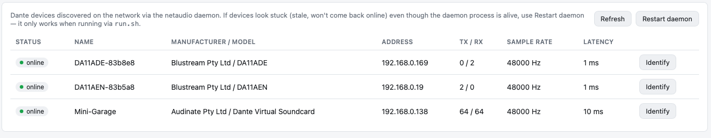
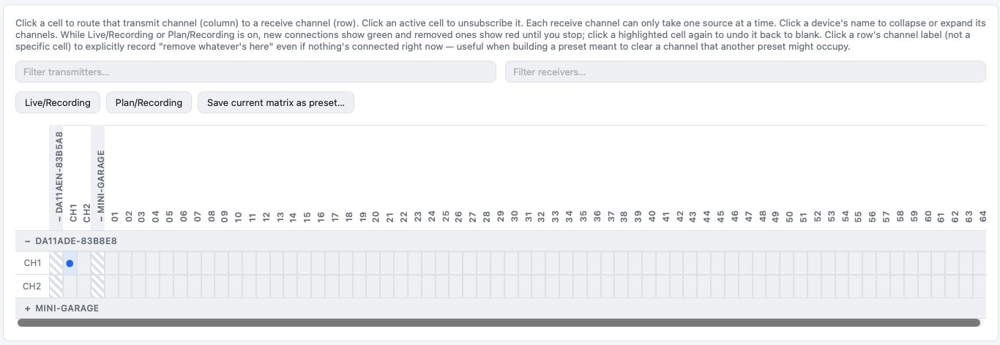
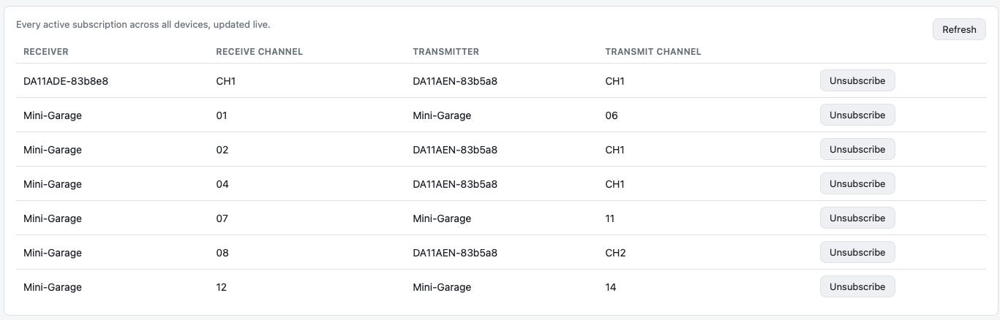
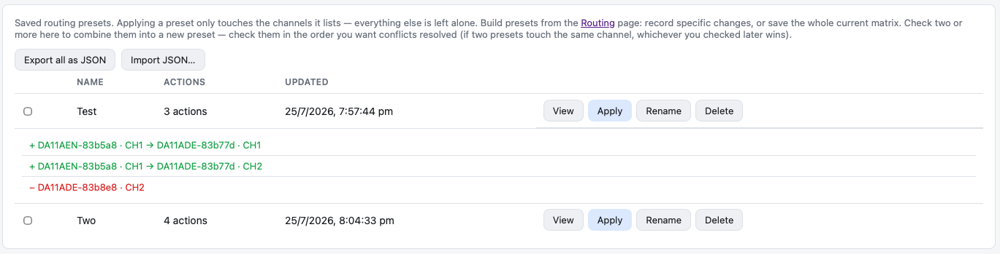
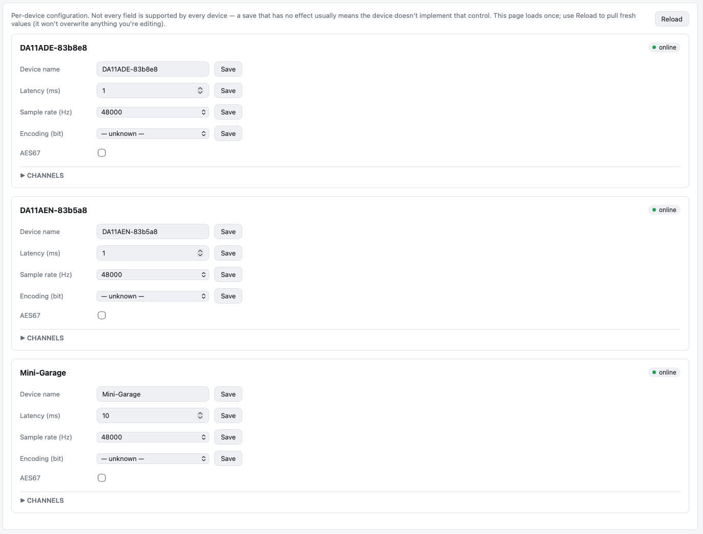
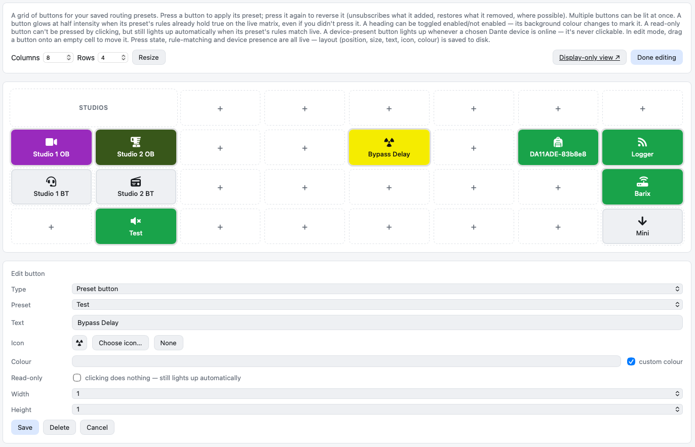

# Dante-web

A web-based control surface for Dante audio devices, built on top of
[network-audio-controller](https://github.com/chris-ritsen/network-audio-controller)
(the `netaudio` Python package). `netaudio` discovers Dante devices via mDNS
and runs a small local daemon; this app is a Flask frontend that talks to
that daemon and gives you a browser UI for:

- **Devices** — list of discovered Dante devices, online status, identify, manual refresh
- **Routing** — a TX × RX matrix to subscribe/unsubscribe audio routes (Dante-Controller-style
  collapsible device groups and filtering), plus an automatic compact dropdown view under 700px width
- **Connections** — flat live list of every active subscription, with unsubscribe
- **Gain** — per-channel input/output gain (1–5), where supported
- **Metering** — live per-channel levels, where supported
- **Presets** — save routing changes as reusable, named deltas (add/remove specific
  channels) or capture the whole current matrix in one go; apply only touches the
  channels a preset actually lists
- **Config** — per-device rename (device/channel), latency, sample rate, encoding, AES67
- **Flows** — TX multicast flow list/create/delete (see caveat below)
- **Panel** — a customizable grid of buttons: apply/reverse a preset on press, show a
  device's live online status, or just a toggleable heading. A button glows at half
  intensity when its preset's rules already match live, even unpressed. Drag to
  rearrange, and there's a display-only view with no editing UI for a kiosk or
  second screen.

Not every Dante device supports every feature (gain, metering, encoding, AES67 in
particular vary by manufacturer/firmware) — the UI degrades gracefully when
a device doesn't report or accept a given control.

**Flows caveat:** the daemon's relay has no `/flow` endpoint, so that page shells
out to the `netaudio` CLI directly instead of the daemon (see Architecture below).
It's slower (fresh mDNS discovery per call) and, in testing, less reliable —
`create` can report success without the flow actually appearing afterward on some
hardware. Treat results as unconfirmed until you double-check.

## Screenshots

**Devices**


**Routing**


**Connections**


**Presets**


**Config**


**Panel**


## Setup

```bash
python3 -m venv .venv
source .venv/bin/activate
pip install -r requirements.txt
```

## Running

```bash
./run.sh
```

Starts the netaudio daemon and the Flask app together, and restarts the daemon
automatically if it dies (the app itself is left alone — if the daemon is
unreachable, pages just show a "daemon unreachable" state until it's back).
Logs go to `logs/`. Ctrl-C stops both.

Open http://localhost:5051 (override with the `PORT` environment variable).

To run the pieces separately instead (e.g. for daemon logs in the foreground):

```bash
netaudio server start   # discovers devices via mDNS, exposes a local HTTP
                         # relay on 127.0.0.1:9000 — no authentication, so
                         # keep it off untrusted networks
python dante_web_app.py
```

The app expects the daemon's relay at `http://127.0.0.1:9000` by default;
override with the `NETAUDIO_RELAY_URL` environment variable if it's running
elsewhere.

## Icons (Font Awesome)

The Panel page's icon picker is backed by [Font Awesome](https://fontawesome.com).
This repo bundles **Font Awesome Free** (`static/vendor/fontawesome-free/`) as the
default — it's freely redistributable (icons: CC BY 4.0, fonts: SIL OFL 1.1, code:
MIT) and works out of the box, no setup needed.

If you have a **Font Awesome Pro** license, you can use it locally for the full
icon set (adds Light/Duotone styles and a much larger catalog) without it ever
being committed — Pro licenses aren't redistributable, so it's gitignored and the
app only uses it if it finds it on disk:

```bash
# Extract your own licensed Pro "web" package download so this exists:
#   static/vendor/fontawesome-pro/css/all.min.css
#   static/vendor/fontawesome-pro/webfonts/...
unzip fontawesome-pro-X.Y.Z-web.zip \
  "fontawesome-pro-*-web/css/all.min.css" \
  "fontawesome-pro-*-web/webfonts/*" \
  "fontawesome-pro-*-web/LICENSE.txt" \
  "fontawesome-pro-*-web/metadata/icons.json" \
  -d /tmp/fa-pro
mv /tmp/fa-pro/fontawesome-pro-*-web static/vendor/fontawesome-pro

# Regenerate the icon picker's search metadata from that kit's icons.json:
python3 -c "
import json
d = json.load(open('static/vendor/fontawesome-pro/metadata/icons.json'))
out = [{'n': n, 'l': i.get('label', n), 's': i.get('styles', []),
        't': (i.get('search', {}) or {}).get('terms', [])[:6]}
       for n, i in d.items() if i.get('styles')]
out.sort(key=lambda x: x['n'])
with open('static/js/panel-icons-data-pro.js', 'w') as f:
    f.write('const FA_ICONS = ' + json.dumps(out, separators=(',', ':')) + ';\n')
"
```

Restart the app afterward — the Pro/Free choice is made once at startup by
checking whether `static/vendor/fontawesome-pro/css/all.min.css` exists.

## Architecture

- `dante_web_app.py` — Flask app: serves the pages and proxies API calls (including
  the `/events` Server-Sent Events stream) to the netaudio daemon's relay.
- `netaudio_client.py` — thin HTTP client for the daemon's relay API (fast path;
  everything except Flows goes through this).
- `netaudio_cli.py` — subprocess wrapper around the `netaudio` CLI, used only for
  TX multicast flows, since the relay doesn't expose that yet.
- `presets_store.py` — JSON-file-backed store (`presets.json`) for routing presets.
- `run.sh` — starts the daemon + Flask app together and supervises the daemon
  (restarts it if it exits); logs to `logs/`.
- `templates/`, `static/` — server-rendered pages with vanilla JS. Each page
  subscribes to a shared live device store (`static/js/common.js`) that's
  kept in sync via the SSE stream, so device status, routing state, etc.
  update in real time without polling. Metering and the Flows/Config pages
  are exceptions — metering is polled explicitly once started (it's opt-in
  per device), and Flows/Config load once rather than live-subscribing, so
  an in-progress edit or a slow CLI call isn't clobbered by an unrelated
  live update.

## License

MIT — see [LICENSE](LICENSE). 

## Trademark disclaimer

This software is designed to work with Dante® enabled devices using the open source netaudio
library. The authors of this software are in no way associated with Audinate Pty Ltd. Audinate®,
the Audinate logo, and Dante® are registered trademarks of Audinate Pty Ltd.
